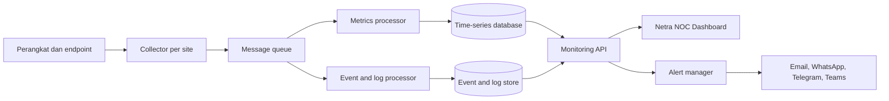

# Arsitektur Network Monitoring Produksi

Dokumen ini melengkapi prototipe Netra NOC dengan rancangan implementasi untuk jaringan kantor, kampus, pabrik, gudang, atau multi-cabang.

> Status implementasi saat ini: mode standalone menggunakan Node.js, PostgreSQL, internal poller ICMP/TCP, serta SNMP v1/v2c. SNMPv3, NetFlow/sFlow/IPFIX, ONVIF aktif, agent endpoint, message queue, dan high availability pada bagian berikut adalah target arsitektur dan belum seluruhnya diimplementasikan.

## 1. Arsitektur Logis

Collector ditempatkan pada setiap site agar polling tetap berjalan ketika koneksi pusat putus. Data dikirim ke pusat melalui TLS dan disimpan sementara di local queue ketika WAN tidak tersedia.

## 2. Metode Pengumpulan Data

| Target              | Protokol utama                            | Metrik penting                                              |
| ------------------- | ----------------------------------------- | ----------------------------------------------------------- |
| Router dan firewall | SNMPv3, API vendor, Syslog, NetFlow/IPFIX | Interface, CPU, RAM, session, VPN, packet loss, policy hit  |
| Managed switch      | SNMPv3, Syslog, sFlow                     | Port status, error, discard, VLAN, PoE, STP, utilization    |
| Radio WiFi          | SNMPv3, API controller                    | RSSI, SNR, noise floor, CCQ, modulation, throughput         |
| Access point        | Controller API, SNMP                      | Client, channel, interference, retry, roaming, bandwidth    |
| Server              | Prometheus exporter, WMI/WinRM, SSH       | CPU, RAM, disk, service, process, hardware sensor           |
| Computer            | Agent, WMI/WinRM, ICMP                    | Availability, CPU, RAM, disk, OS, logged-on user            |
| Printer             | Printer-MIB via SNMP                      | Toner, paper, counter, error, consumable life               |
| NVR                 | SNMP/API vendor, RTSP probe               | Disk, recording status, channel, retention, health          |
| CCTV                | ICMP, RTSP/ONVIF, API vendor              | Reachability, stream, bitrate, frame rate, image loss       |
| LAN/WAN/Internet    | SNMP counters, NetFlow/sFlow/IPFIX        | Throughput, conversation, application, packet loss, latency |

Gunakan SNMPv3 untuk produksi. SNMPv2 hanya dipakai pada perangkat lama di management VLAN yang dibatasi ACL.

## 3. Komponen yang Disarankan

- Collector: Go atau Python worker untuk ICMP, SNMP, API, ONVIF, dan RTSP probe.
- Flow collector: goflow2, ElastiFlow, atau ntopng untuk NetFlow/sFlow/IPFIX.
- Metrics: VictoriaMetrics atau Prometheus dengan remote write.
- Logs/events: Loki atau OpenSearch untuk Syslog dan audit event.
- Queue: NATS JetStream, RabbitMQ, atau Kafka sesuai skala.
- Alerting: Alertmanager dengan escalation policy dan maintenance window.
- API: REST/WebSocket untuk inventory, metrics, topology, alert, dan realtime update.
- Database konfigurasi: PostgreSQL untuk device inventory, credential reference, site, dan user.

## 4. Segmentasi dan Keamanan

- Tempatkan collector pada management VLAN; jangan membuka SNMP dari user VLAN.
- Simpan credential di Vault/KMS, bukan pada database atau source code.
- Gunakan SNMPv3 authPriv, TLS antar komponen, RBAC, SSO, MFA, dan audit log.
- Batasi collector dengan ACL hanya ke protocol dan port yang diperlukan.
- Pisahkan role administrator, operator NOC, viewer, auditor, dan vendor support.
- Terapkan backup terenkripsi dan uji restore secara berkala.

### Autentikasi Produksi

- Gunakan identity provider berbasis OIDC/SAML seperti Entra ID, Keycloak, Okta, atau Google Workspace.
- Untuk akun lokal, hash password dengan Argon2id dan terapkan password policy serta account lockout.
- Simpan session dalam secure HttpOnly SameSite cookie; jangan menyimpan access token sensitif di localStorage.
- Wajibkan MFA untuk administrator dan akses dari luar management network.
- Terapkan idle timeout, absolute session expiry, session revocation, CSRF protection, dan login rate limiting.
- Catat login berhasil/gagal, logout, perubahan role, perubahan konfigurasi, dan acknowledgement alert dalam audit log immutable.

## 5. Baseline Alert

| Alert                   |      Warning |     Critical | Delay yang disarankan |
| ----------------------- | -----------: | -----------: | --------------------: |
| Device unreachable      | 2 kali gagal | 5 kali gagal |    60 detik per probe |
| Packet loss             |         > 2% |         > 8% |               5 menit |
| Latency internet        |      > 80 ms |     > 150 ms |               5 menit |
| Interface utilization   |        > 75% |        > 90% |              10 menit |
| CPU perangkat           |        > 75% |        > 90% |              10 menit |
| Memory perangkat        |        > 80% |        > 95% |              10 menit |
| Interface error/discard |       > 0.5% |         > 2% |               5 menit |
| WiFi SNR                |      < 25 dB |      < 15 dB |              10 menit |
| NVR storage             |        > 80% |        > 92% |              15 menit |
| CCTV stream             | Intermittent |         Down |          3 kali probe |

Threshold harus dibaseline per kelas perangkat. Gunakan dependency suppression agar satu router mati tidak menghasilkan ratusan alert turunan.

## 6. Retensi Data

- Raw metrics resolusi 15-30 detik: 30 hari.
- Downsample 5 menit: 12 bulan.
- Downsample 1 jam: 3 tahun.
- Syslog warning/critical: 12 bulan atau mengikuti kebijakan audit.
- Flow detail: 30-90 hari; agregat per aplikasi/site disimpan 12 bulan.
- Configuration backup: setiap perubahan dan snapshot harian, minimum 12 bulan.

## 7. High Availability

- Jalankan dua collector per site kritis dengan leader election.
- Gunakan dua instance API dan alert manager di belakang load balancer.
- Replikasi PostgreSQL serta metrics storage ke availability zone berbeda.
- Queue lokal collector minimal menampung 24 jam data saat WAN terputus.
- Monitor platform monitoring dengan health check eksternal terpisah.

## 8. Tahapan Implementasi

1. Inventaris site, subnet, perangkat, owner, SLA, dan jalur dependensi.
2. Siapkan management VLAN, credential SNMPv3, Syslog, dan flow export.
3. Deploy collector pada site pusat lalu validasi router, firewall, dan core switch.
4. Tambahkan WiFi, server, NVR/CCTV, printer, dan endpoint secara bertahap.
5. Bangun baseline 2-4 minggu sebelum mengaktifkan escalation penuh.
6. Integrasikan notifikasi, ticketing, backup konfigurasi, dan laporan SLA.
7. Lakukan drill kegagalan WAN, collector, database, dan notification channel.
